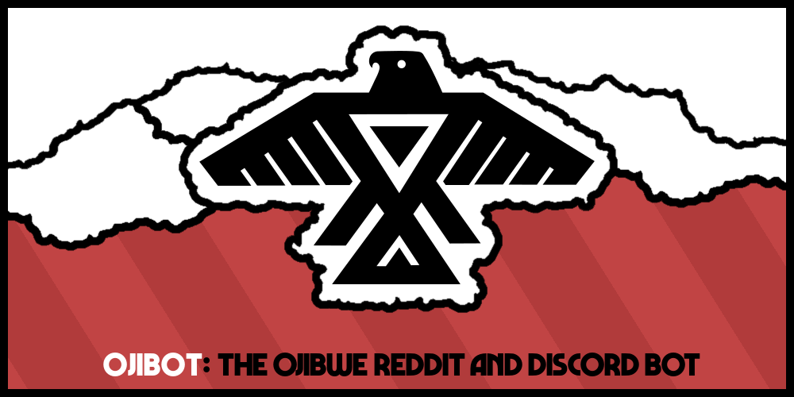

# Ojibot: The Ojibwe Reddit and Discord Bot
Ojibot is a bot for Discord and Reddit that performs tasks relating to the
Ojibwe language, aka Anishinaabemowin.

## Synopsis
Reddit is a website composed of many thousands of user-made forums called
'subreddits'. Discord is a site with user-made chatrooms called 'Discord
servers'. Both of these services host dedicated communities of First Nations'
language learners, and both sites allow for automated accounts that respond to
comments with useful information. This project is meant to fill the Ojibwe-language
bot niche!

### Features
Ojibot commands can be invoked with /u/ojibot [command] on Reddit and with !oji
[command] on enabled Discord servers. Parts in square brackets can be omitted.
Commands are case-agnostic. 

| Command | Description |
| --- | --- |
| eng[lish] | Translates the following words from Ojibwe to English |
| oji[bwe] | Translates the follwing words from English to Ojibwe |
| syl[labics] | Converts text into Ojibwe Syllabics |
| rom[an] | Converts syllabics into romanized text |
| guide | Shows a writing guide for Ojibwe |
| syl-guide | Shows a writing guide for Ojibwe Syllabics |

### Detailed Overview
This section is quite technical.

Commands can take options for more granular outputs. Options are written like
arguments in many programming languages, taking the form `command(option1, option2)`.

#### eng[lish]
The received word is case-normalized and seached in the database. If no such
word exists, a number of modifications can occur to normalize the orthography
to a standard variant of the Fiero double-vowel system (“gitchi” or “gici”
become “gichi”, “ânîn” becomes “aaniin”, etc.) If the new word isn't found, a fuzzy
seach is applied and any results that are similar enough will be shown.

If a word is found in the database, the definition will be returned. TODO what other data?

#### oji[bwe]
Same process as above, without the Fiero-orthography conversions.

#### syl[labics]
Words are case-normalized and roughly converted to Fiero double-vowel
orthography. The words are then converted and returned as syllabic text.

The default syllabics use Eastern a-position finals, left-hand w-dot, and vowel
pointing. By default, no lenis-fortis distinction is made.

- [ ] Discord bot
	- [x] Has credentials
	- [x] Setup / basic functionality
	- [x] Responds to specific commands
	- [x] Usable on many servers
	- [ ] Configurable per-server
- [ ] Reddit bot
	- [ ] Has credentials
	- [ ] Setup / basic functionality
	- [ ] Responds to specific commands
- [ ] Ojibwe to English
	- [x] Finds correct info
	- [ ] Formats information correctly
		- [x] Discord
		- [ ] Reddit
	- [ ] Search / return options
	- [x] Normalized (lowercase, Fiero) search
	- [x] Fuzzy search
- [ ] English to Ojibwe
	- [ ] Finds correct info
	- [ ] Formats information correctly
		- [ ] Discord
		- [ ] Reddit
	- [ ] Search / return options
	- [ ] Fuzzy search
- [ ] Romanized to syllabics
	- [ ] Converts
	- [ ] Search / return options
- [ ] Syllabics to romanized
	- [ ] Converts
		- [ ] Uses database instead of guessing
			- [ ] Fuzzy search
	- [ ] Search / return options
- [ ] Guide
	- [ ] Fiero
		- [ ] Discord
		- [ ] Reddit
	- [ ] Syllabic
		- [ ] Discord
		- [ ] Reddit
